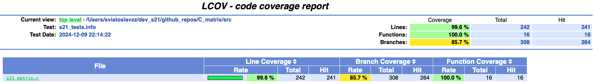

# C_matrix  

Implementation of own library for processing numerical matrices in the C programming language. 

## Contents  

1. [Matrix structure](#matrix-structure-in-c-language)
2. [Matrix operations](#matrix-operations)
3. [Specifications](#specifications)
4. [Build](#build)
5. [Unit tests](#unit-tests)
6. [LCOV report](#lcov-report)


### Matrix structure in C language

```c
typedef struct matrix_struct {
    double** matrix;
    int rows;
    int columns;
} matrix_t;
```

## Matrix operations

All operations (except matrix comparison) returns the resulting code:
- 0 - OK
- 1 - Error, incorrect matrix
- 2 - Calculation error (mismatched matrix sizes; matrix for which calculations cannot be performed, etc.)

### Creating matrices (create_matrix)

```c
int s21_create_matrix(int rows, int columns, matrix_t *result);
```

### Cleaning of matrices (remove_matrix)

```c
void s21_remove_matrix(matrix_t *A);
```

### Matrix comparison (eq_matrix)

```c
#define SUCCESS 1
#define FAILURE 0

int s21_eq_matrix(matrix_t *A, matrix_t *B);
```

The matrices A, B are equal |A = B| if they have the same dimensions and the corresponding elements are identical, thus for all i and j: A(i,j) = B(i,j)

The comparison is up to and including 7 decimal places.

### Adding (sum_matrix) and subtracting matrices (sub_matrix)

```c
int s21_sum_matrix(matrix_t *A, matrix_t *B, matrix_t *result);
int s21_sub_matrix(matrix_t *A, matrix_t *B, matrix_t *result);
```

The sum of two matrices A = m × n and B = m × n of the same size is a matrix C = m × n = A + B of the same size whose elements are defined by the equations C(i,j) = A(i,j) + B(i,j).

The difference of two matrices A = m × n and B = m × n of the same size is a matrix C = m × n = A - B of the same size whose elements are defined by the equations C(i,j) = A(i,j) - B(i,j).


```
            1 2 3   1 0 0   2 2 3
С = A + B = 0 4 5 + 2 0 0 = 2 4 5
            0 0 6   3 4 1   3 4 7
```

### Matrix multiplication by scalar (mult_number). Multiplication of two matrices (mult_matrix)

```c
int s21_mult_number(matrix_t *A, double number, matrix_t *result);
int s21_mult_matrix(matrix_t *A, matrix_t *B, matrix_t *result);
```

The product of the matrix A = m × n by the number λ is the matrix B = m × n = λ × A whose elements are defined by the equations B = λ × A(i,j).

The product of A = m × k by B = k × n is a matrix C = m × n = A × B of size m × n whose elements are defined by the equation C(i,j) = A(i,1) × B(1,j) + A(i,2) × B(2,j) + ... + A(i,k) × B(k,j).

### Matrix transpose (transpose)

```c
int s21_transpose(matrix_t *A, matrix_t *result);
```

The transpose of matrix A is in switching its rows with its columns with their numbers retained


### Minor of matrix and matrix of algebraic complements (calc_complements)

```c
int s21_calc_complements(matrix_t *A, matrix_t *result);
```

Minor M(i,j) is a (n-1)-order determinant obtained by deleting out the i-th row and the j-th column from the matrix A.

### Matrix determinant

```c
int s21_determinant(matrix_t *A, double *result);
```

The determinant is a number that is associated to each square matrix and calculated from the elements using special formulas. \
Tip: The determinant can only be calculated for a square matrix.

The determinant of a matrix equals the sum of the products of elements of the row (column) and the corresponding algebraic complements.


### Inverse of the matrix (inverse_matrix)

```c
int s21_inverse_matrix(matrix_t *A, matrix_t *result);
```

A matrix A to the power of -1 is called the inverse of a square matrix A if the product of these matrices equals the identity matrix.

If the determinant of the matrix is zero, then it does not have an inverse.

The formula to calculate the inverse of matrix is $`A^{-1}=\frac{1} {|A|} × A_*^T`$


## Specifications

Implemented basic operations with matrices (partially described [above](#matrix-operations)): create_matrix (creation), remove_matrix (cleaning and destruction), eq_matrix (comparison), sum_matrix (addition), sub_matrix (subtraction), mult_matrix (multiplication), mult_number (multiplication by number), transpose (transpose), determinant (calculation of determinant), calc_complements (calculation of matrix of algebraic complements), inverse_matrix (finding inverse of the matrix).

- The library is developed in C language of C11 standard using gcc compiler;
- Used the POSIX.1-2017 standard;
- Make it as a static library named *s21_matrix.a* (with the s21_matrix.h header file);
- The library is developed according to the principles of structured programming;
- Prepared full coverage of library functions code with unit-tests using the Check library;
- Unit tests covers at least 80% of each function (checked using gcov);  
- Provided a Makefile for building the library and tests (with targets all, clean, test, s21_matrix.a, gcov_report);
- The gcov_report target should generate a gcov report in the form of an html page. Unit tests must be run with gcov flags to do this; 
- The matrix must be implemented as the structure described [above](#matrix-structure-in-c-language);
- Verifiable accuracy of the fractional part is up to 6 decimal places.

## Build

- go to `src` folder
- run `make s21_matrix.a` to build a library
- now you can use `decimal.a` library and compile with any required program.

## Unit tests

- go to `src` folder
- run `make` to build all targets including (decimal.a, test, gcov_report) / or run `make test` to run tests separately
- tests results will be printed to stdout

## LCOV report

- go to `src` folder
- run `make` to build all targets including (decimal.a, test, gcov_report) / or run `make gcov_report` to run tests with gcov separately
- after report is generated go to `src/report` folder and open `index.html` file to see LCOV coverage

<figure>
  
<figcaption>LCOV report</figcaption>
</figure>